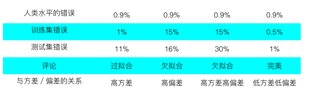
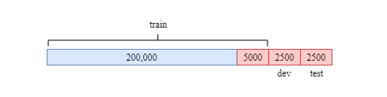
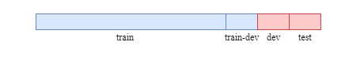
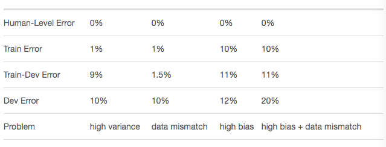
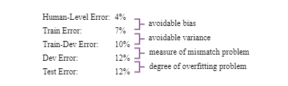
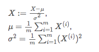
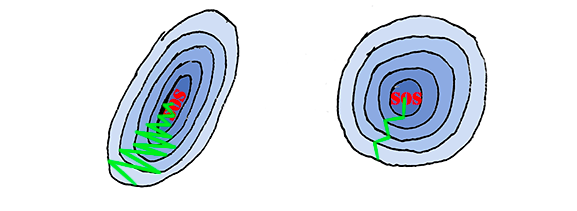
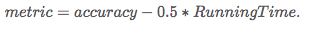
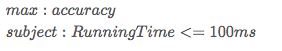
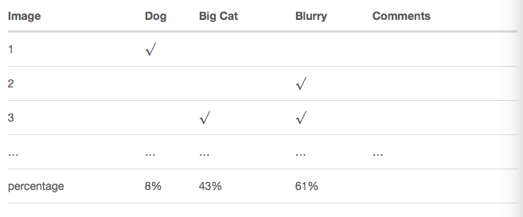

##  Practical Tips （训练技巧）

### 训练集/验证集/测试集

在我们开始讲实战技巧前，请务必先了解清楚这三者的区别。

#### 训练集（Train Dataset）

训练集用来构建模型，并且训练**普通参数**的，而不是**超参数**，超参数的选择与调整与训练集无关，训练过程是不会影响超参数的，而这里需要深入解释下**普通参数和超参数**。

> **普通参数：** 即模型参数，为模型内部的配置参数，可以用数据估计和学习得到，一般不需要手动设置，通常作为学习模型的一部分保存，在模型预测时候需要用到的。如逻辑回归和线性回归的系数、SVM的支持向量、人造神经网络的权重等。
>
> **超参数： ** 即模型外部配置的参数，其值不能从数据估计中得到，一般需要人为设置or通过启发式方法来设置，根据给定的预测建模问题来优化调整。如Learning Rate、KNN的K值等等。

#### 验证集（Dev Dataset）

用来验证训练集训练好的模型是否准确，一般我们会根据验证集的测试结果来调整我们的超参数，使得模型在验证集上表现最优。

#### 测试集（Test Dataset）

一个全新的数据集，用来测试最后模型的效果。

**通过的数据集划分方法可以依循下面的原则：**

1）随机挑选70%的数据作为训练集，30%的数据作为测试集（或者60%训练集、20%验证集、20%测试集），但如果我们的数据集很大（100万行），我们可以用更多的数据来训练（比如 98%），1%的数据来验证，1%的数据来测试。

2）确保验证集和测试集是同一分布。

**不过在实际情况中，有可能出现的情况是：**

> 1）我们要在某个特定领域中建立一个模型，但我们在这个领域只有很少量有标签的数据集（比如：10000个）
>
> 2）“可幸”的是，我们可以从另一个类似的任务中获得更多的数据集（比如：20万个）

在这种情况下，我们该如何划分训练、验证和测试集呢？

最简单的办法就是合并两个数据集并打乱它们，然后我们可以把这个新数据集划分Train/Dev/Test Dataset，但这并不是一个好办法，因为我们的目标是去构建一个特定领域的模型，而不是一个“冒牌货”，而且我们也不能拿一些领域外的数据来测试我们的模型。

**✅ 正确的做法：**

1）所有的”类似样本“（20万个）可以加入到训练集中去用来训练模型，但不能加入到验证和测试集。

2）挑选部分特定领域的样本加入到训练集中参与模型训练。

3）验证集和测试集的样本均来自特定领域数据。

上面的样本划分逻辑可以看下图展示：

### 过/欠拟合、方差/偏差的表现及解决方法

对于分类任务，人类的分类错误应该是在0%附近，下面我们通过一张表来说明训练集和验证集的可能表现与实际的原因关系：

#### 解决方案

#### 与人类水平的比较

你应该注意到，在上面的表格中，人类水平的错误率在0.9%左右，假设人类水平的错误率不同，但训练测试集上的错误率一致呢？如下图：

尽管模型错误率在数据集上的表现是一样的，但是左边的人类错误率只有1%，所以这个模型是属于高偏差的，而右边的则是高方差。

对于一个优秀的模型，完全是可以做到比人类分类水平要高的，但如果现实不是这样子的话，我们可以做下面几个步骤来达到我们的目的：

1）从人类中获取更多的标签用来训练模型；

2）从手动误差分析中获得改善的灵感；

3）从方差/偏差分析中获得改善的灵感。

### 不匹配的数据分布

当我们打算构建某个领域的模型，同样的我们还是只有很少的标签数据（例如：10000行），但我们可以从另一个**类似**的任务中获得更多的数据集（比如：20万个），根据第一节的方案，我们可以这样子划分我们的数据集:

但是训练集的数据分布与验证集以及测试集有很大的差异，这可能会导致data mismatch的问题。为了检查我们的数据是否存在这个problem，我们可以随机从训练集中挑选一个子集（subset）作为训练验证数据集（Train-Dev Dataset），这个数据集与训练集肯定是同一个分布的，我们把它单独拿出来，不参与模型训练，如下图：

#### 总结一下：

我们可以从不同数据集的错误率比较，大致看出问题所在：

所以我们可以大致依循下面两步来定位Mismatch Distribution Problem：

1）进行手动的误差分析并尝试理解不同数据集之间的错误率差距表现；

2）根据错误分析结果，我们可以尝试着让训练集的样本与Train-Dev Dataset的样本尽可能相似，同样的，我们还可以从训练集中抽取部分样本用来构建 Dev/Test set。

### 输入归一化

我们有一个训练集拥有m个样本，Xi代表第i个样本，那么输入的归一化如下：

这里需要注意的是，在测试集中，我们必须要使用训练的方差和均值来归一化我们测试集的数据，而不是使用测试集自己的方差和均值。

归一化后的数据，会让部分算法的收敛速度变得很快，比如梯度下降算法，这个在NG的课程中讲得是比较多了，大家可以看看下图：（左边的是原始数据，右边的是归一化后的数据）

### 使用单一模型来评估效果

我们我们不仅关心模型的表现，我们还关注运行时间的话（当然还有很多其他指标），那我们可以考虑设计一个单一模型来整体评估我们的模型，比如我们可以结合预测准确率以及运行时间的指标来设计一个综合指标：

当然，我们还可以这样子设计：

也就是把我们关心的指标，作为评估模型好坏的量化指标，这样子在实际的应用中会更加的合理。

### 误差分析

#### 进行误差分析

误差分析对于我们下一步如何优化模型是十分有用的，比如为了发现为什么有些样本的标签是缺失的，那么我们就可以从中抽取100个标签缺失的样本，然后一个一个去查看。

通过手动查看这些标签缺失的样本，我们可以大概定位到原因。比如，在上面的表格中，我们发现这些标签缺失的样本有61%的图像都是blurry，因此下一步我们可以把更多的注意放在blurry的识别。

#### 清洗错误的标签

有的时候，我们的数据集中有噪声，换种说法也就是说有些标签是错误的，同样的我们可以随机从Dev/Test set 中抽取100个实例来看看。

比如这个例子，我们模型在Dev/Test set上的错误率是10%，然后随机抽取的100个样本里，通过人眼一个个看，统计得到大概有6%的图像标签是错误的，也就是说我们可以把错误率修正为10%-10%*6% = 9.4%
